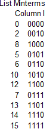
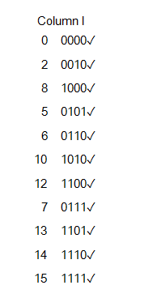
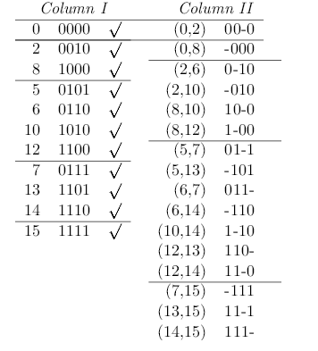
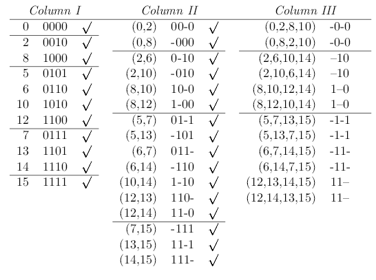
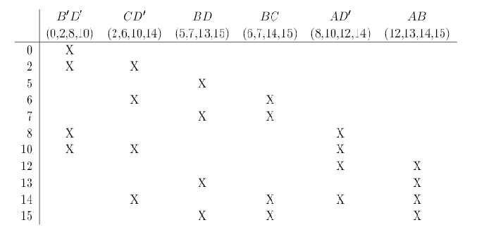
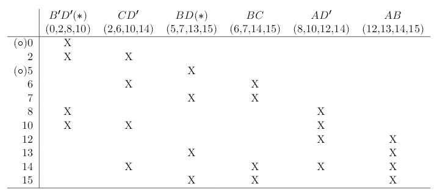
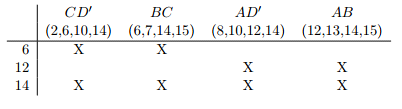
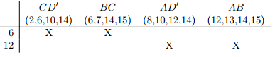
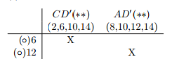

# Theory:

## Quine - Mc Clusky Algorithm

The Quine – McCluskey algorithm is a method used for minimization of boolean functions that was developed by W.V.Quine and extended by Edward J.McCluskey.

The minimization of Boolean expressions using K-maps is usually limited to a maximization of six variables. The Quine – McCluskey method also known as the Tabular method is a more systematic method of minimizing expression of even larger number of variables. This is suitable for hand computation as well as computation by machine.

### Procedure to perform the experiment:Quinn - Mc Clusky Algorithm

There are 4 main steps in the Quine-McCluskey algorithm:
- Generate Prime Implicants
- Construct Prime Implicant Table
- Reduce Prime Implicant Table
  - Remove Essential Prime Implicants
  - Row Dominance
  - Column Dominance
- Solve Prime Implicant Table

### Example #1:

F(A; B; C; D) =m(0;2;5;6;7;8;10;12;13;14;15)

#### Step 1: Generate Prime Implicants

List all the minterms.Arrange all minterms in group of the same number of 1s in their binary representation in column 1.

A check (✓) is written next to every minterm which can combined with another 

##### Combine Pairs of Products from Column II

A check (✓) is written next to every product which can combined with another product.

Column III contains a number of duplicate entries,e.g.(0,2,8,10) and (0,8,2,10). Duplicate entries appear because a product in Column III can be formed in several ways. For example, (0,2,8,10) is formed by combining products (0,2) and (8,10) from Column II, and (0,8,2,10) (the same product) is formed by combining products (0,8) and (2,10).

#### Step 2: Construct Prime Implicant Table.

#### Step 3: Reduce Prime Implicant Table.

***Iteration #1.***

1.  Remove Primary Essential Prime Implicants

\* * indicates a secondary essential prime implicant ◦ indicates a distinguished row

2. Row Dominance 

3. Column Dominance

***Iteration #2.***

1. Remove Secondary Essential Prime Implicants 

#### Step 4: Solve Prime Implicant Table. 

No other rows remain to be covered, so no further steps are required. Therefore, the minimum-cost solution consists of the primary and secondary essential prime implicants B'D' , BD, CD' and AD'

F= B'D' + BD + CD'+ AD'
